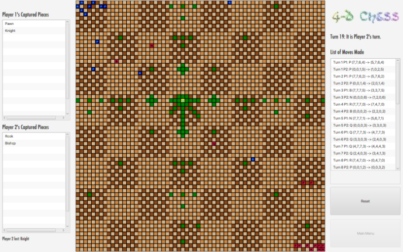

# 4DChess

The idea behind this game was to link together 64 chessboards to make a really big, 8x8 chessboard that could simulate playing a 4-dimensional game of chess. Unlike
most variants of 3-D chess, the rules of this game generally stick to the rules of 2-D chess as closely as possible. Rooks move in a straight line only, bishops
move along diagonals, Queens along both, Pons up 2 and diagonal one if they can capture, knights in an L-shape. I took some creative liberties for the sake of both
balance and time complexity and made it so that Bishops, Knights, Queens, Pons, and Kings can only move in at most two dimensions at once, which is also true of the
base game of chess (the difference being that instead of the Queen being restricted to, say, movement across the X-Y plane, she can now move across the X-Y, X-Z, X-W,
Y-Z, Y-W, and Z-W planes). I placed the starting pieces opposite from each other in 3 dimensions rather than 4 for balance sake, but the game can probably be played
just as easily with the two starting colors in opposite corners.

(Playing this game is not 100% statistically unproven to increase the size of your brain tenfold!)
